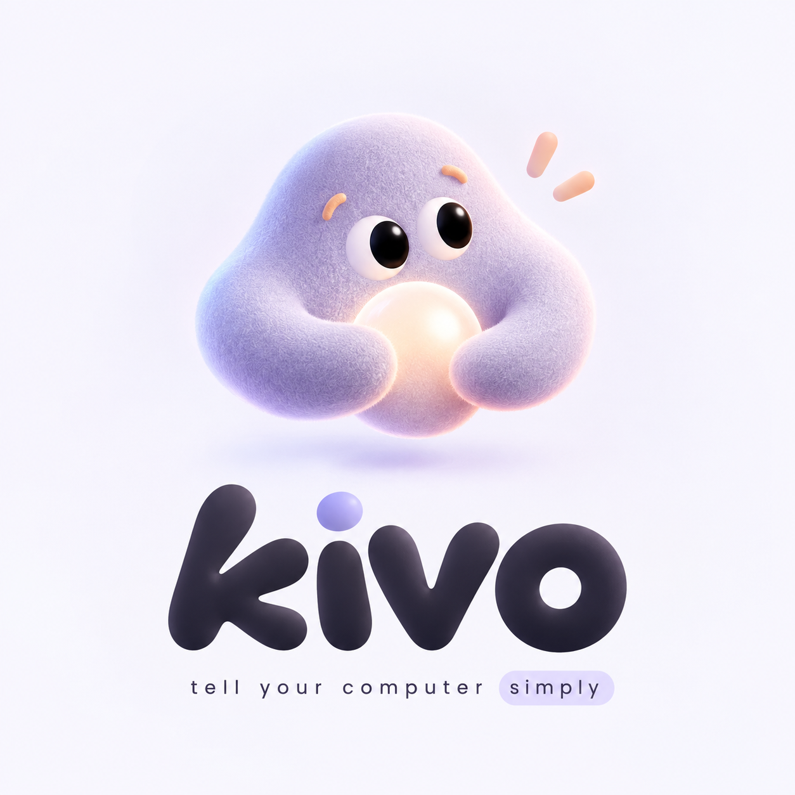
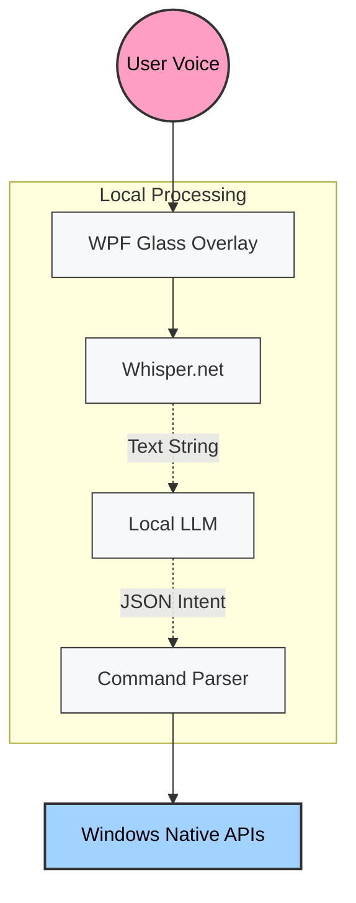

  
  
  <h2>tell your computer simply</h2>
  
Kivo automates the boring stuff on your computer. You do the creative stuff.

## What is Kivo?

Kivo is a fast local desktop tool. You speak to it and it figures out what you want to do on your computer. It runs entirely on your own machine. Your data is private and your voice recordings never leave your computer. 

## Features

* **Local Voice Processing:** Powered by Whisper.net for instant transcriptions. 
* **Smart Actions:** Kivo understands natural language intent and drives your OS directly.
* **Sleek Overlay:** A completely unobtrusive widget that only shows up when you need it.
* **Lightning Fast:** Zero network latency because we don't rely on slow cloud APIs.

## Tech Stack

| Area | Technologies |
| :--- | :--- |
| **Desktop Client** |  C# &nbsp;&nbsp;  .NET WPF |
| **Landing Page** |  Next.js &nbsp;&nbsp;  React |
| **Intelligence** |  Whisper.net &nbsp;&nbsp;  GGUF Local LLMs |

## Architecture

Here is a quick look at how the data flows when you speak to Kivo.

## Setup

1. Clone this repository.
2. Build the C# project in the `Kivo` folder using Visual Studio.
3. To run the landing page locally, use `npm run dev` in the `kivo-landing` folder.
